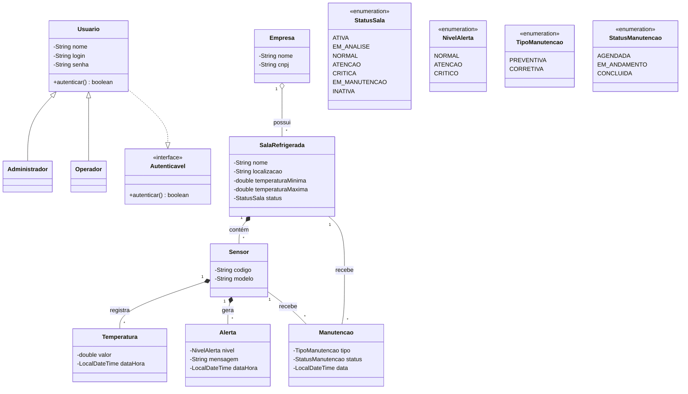

```mermaid
classDiagram
    class Usuario {
        -String nome
        -String login
        -String senha
        +autenticar() boolean
    }
    class Administrador
    class Operador
    class Autenticavel {
        <<interface>>
        +autenticar() boolean
    }

    Usuario <|-- Administrador
    Usuario <|-- Operador
    Usuario ..|> Autenticavel

    class Empresa {
        -String nome
        -String cnpj
    }

    class SalaRefrigerada {
        -String nome
        -String localizacao
        -double temperaturaMinima
        -double temperaturaMaxima
        -StatusSala status
    }

    class StatusSala {
        <<enumeration>>
        ATIVA
        EM_ANALISE
        NORMAL
        ATENCAO
        CRITICA
        EM_MANUTENCAO
        INATIVA
    }

    class Sensor {
        -String codigo
        -String modelo
    }

    class Temperatura {
        -double valor
        -LocalDateTime dataHora
    }

    class NivelAlerta {
        <<enumeration>>
        NORMAL
        ATENCAO
        CRITICO
    }

    class Alerta {
        -NivelAlerta nivel
        -String mensagem
        -LocalDateTime dataHora
    }

    class Manutencao {
        -TipoManutencao tipo
        -StatusManutencao status
        -LocalDateTime data
    }

    class TipoManutencao {
        <<enumeration>>
        PREVENTIVA
        CORRETIVA
    }

    class StatusManutencao {
        <<enumeration>>
        AGENDADA
        EM_ANDAMENTO
        CONCLUIDA
    }

    Empresa "1" o-- "*" SalaRefrigerada : possui
    SalaRefrigerada "1" *-- "*" Sensor : contém
    Sensor "1" *-- "*" Temperatura : registra
    Sensor "1" *-- "*" Alerta : gera
    SalaRefrigerada "1" -- "*" Manutencao : recebe
    Sensor "1" -- "*" Manutencao : recebe
```