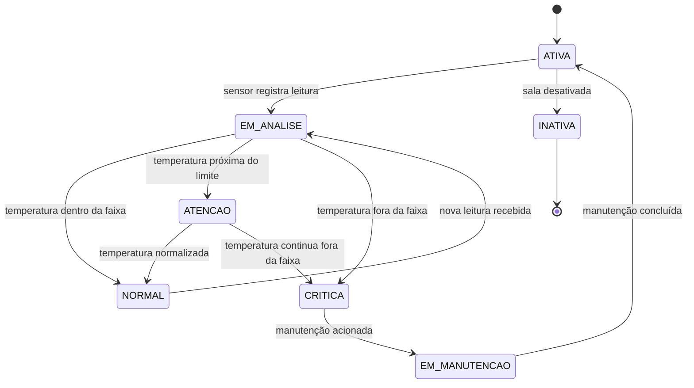

```mermaid
stateDiagram-v2
    [*] --> ATIVA

    ATIVA --> EM_ANALISE : sensor registra leitura
    EM_ANALISE --> NORMAL : temperatura dentro da faixa
    EM_ANALISE --> ATENCAO : temperatura próxima do limite
    EM_ANALISE --> CRITICA : temperatura fora da faixa

    NORMAL --> EM_ANALISE : nova leitura recebida
    ATENCAO --> NORMAL : temperatura normalizada
    ATENCAO --> CRITICA : temperatura continua fora da faixa

    CRITICA --> EM_MANUTENCAO : manutenção acionada
    EM_MANUTENCAO --> ATIVA : manutenção concluída

    ATIVA --> INATIVA : sala desativada
    INATIVA --> [*]
```